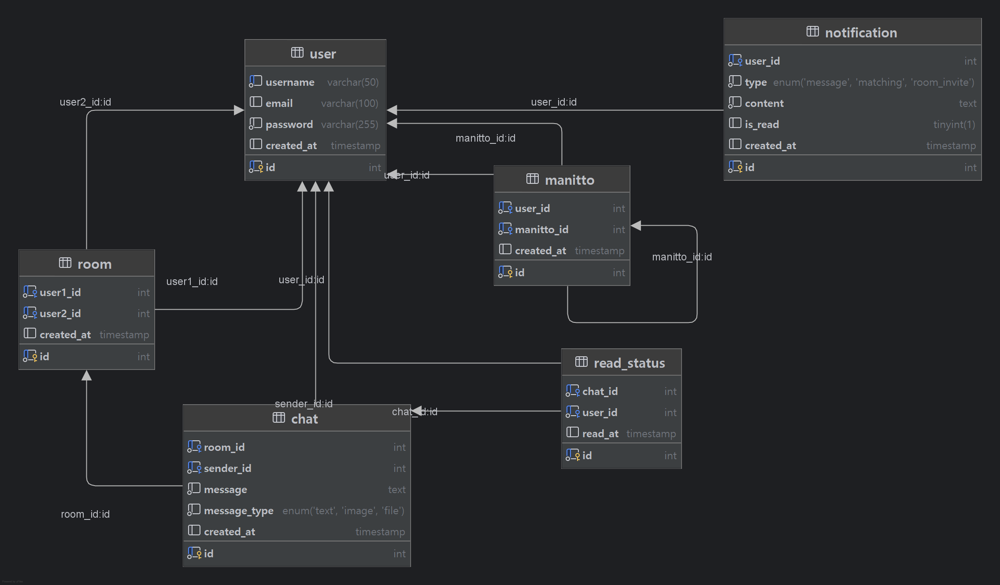

## **우리또(마니또 프로그램) 개요**

## 👨‍💻 팀원 소개

| 임지섭                                                                    | 서용준                                                                  | 노영재                                                                   |
| ------------------------------------------------------------------------- | ----------------------------------------------------------------------- | ------------------------------------------------------------------------ |
|  |  |  |

### 0. 프로젝트 구조

```plaintext
manitto
 ├── src
 │   ├── main
 │   │   ├── java
 │   │   │   ├── controller
 │   │   │   │   ├── UserController.java
 │   │   │   │   ├── RoomController.java
 │   │   │   ├── domain
 │   │   │   │   ├── User.java
 │   │   │   │   ├── Room.java
 │   │   │   ├── repository
 │   │   │   │   ├── UserRepository.java
 │   │   │   │   ├── RoomRepository.java
 │   │   │   ├── service
 │   │   │   │   ├── UserService.java
 │   │   │   │   ├── RoomService.java
 │   │   │   │   ├── ChatService.java
 │   │   │   ├── util
 │   │   │   │   ├── AsciiArtUtil.java
 │   │   │   │   ├── Hasher.java
 │   │   │   │   ├── DatabaseUtil.java
 │   │   │   │   ├── RoomCodeGenerator.java
 │   │   │   ├── ManittoMain.java
```

### **1. 실행 흐름**

### **① 로그인 또는 회원가입 선택**

```
WOORITTO에 오신 것을 환영합니다.

1. 로그인 2. 회원가입
```

### **(1) 로그인 흐름**

```
EMAIL: <email>
PW: <password>
```

- 유효하지 않은 이메일 또는 비밀번호 입력 시 "아이디 또는 비밀번호가 일치하지 않습니다." 출력

### **(2) 회원가입 흐름**

```
NAME: <name>
EMAIL: <email>
PW: <password>
Confirm PW: <password>
```

- 올바르지 않은 이메일 형식 입력 시 "올바른 이메일 형식이 아닙니다." 출력
- 비밀번호와 비밀번호 확인이 일치하지 않을 시 "비밀번호가 일치하지 않습니다." 출력

### **② 방 생성 또는 방 참가 선택**

```
원하시는 작업을 선택하세요.
1. 방 생성 | 2. 방 참가 | 3. 종료
```

### **(1) 방 생성 흐름**

```
생성할 방 이름을 입력하세요: <room name>
최대 인원 수를 입력하세요: <max user>
```

```
방 생성 완료! 참가 코드: ABCDEF (자동 생성)
```

- 참가 코드가 생성됨
- 이후, 방 생성 완료 메시지 출력

### **(2) 방 참가 흐름**

```
참가할 방의 코드를 입력하세요: ABCDEF
```

- 올바르지 않은 참가 코드 입력 시 "올바른 참가 코드가 아닙니다." 출력

---

### **2. 채팅방 화면**

채팅방 예시

```
익명1: 안녕!
익명2: 좋은 하루 보내!
```

- 실시간 채팅 메시지 표시

---

### **3. 기능 요약**

✅ **사용자 관리**

- 로그인
- 회원가입

✅ **방 관리**

- 방 생성 (이름, 인원 제한, 참가 코드 생성)
- 참가 코드 입력을 통한 방 참가

✅ **채팅 기능**

- 메시지 송수신
- 현재 방 내 메시지 표시

### 4. **팀 규칙**

### 1. 로그 레벨 기준

| 로그 레벨 | 용도                                            |
| --------- | ----------------------------------------------- |
| TRACE     | 매우 상세한 디버깅용 (일반적으로 사용하지 않음) |
| DEBUG     | 개발 중 상태 확인 및 흐름 추적                  |
| INFO      | 일반적인 실행 정보 (예: 유저 로그인, 요청 성공) |
| WARN      | 예상 가능한 문제 (예: 잘못된 입력값)            |
| ERROR     | 예외 및 심각한 오류 발생 시                     |

### 2. 브랜치

- branch 이름은 feat/{feature name} 으로 통일

### 3. 커밋 메세지

- `feat` 새로운 기능을 추가한 경우
- `fix` 버그를 고친 경우
- `docs` 문서를 수정한 경우
- `refactor` 코드 리팩토링에 대한 커밋
- `rename` 파일 혹은 폴더명을 수정한 경우
- `remove` 파일을 삭제한 경우

## 콘솔 입출력 예시

```

⣼⢧⡀⠀⠀⠀⠀⠀⠀⠀                                       ⠀⣠⠶⡆
⢻⡈⠻⣦⣀⣀⣀⣀⣀⠀⠀⠀ ⣴⠟⠉⠁⠀⠉⠛⢦⡀⢀⡴⠛⠉⠁⠈⠙⠻⣄⠀ ⣀⣠⣤⣤⣤⣤⡤⠖⠋ ⣸⠇
⡿⠳⣤⣀⡀⠀⠀⠉⠉⠉⠳⢦⣼⠃⠀⠀⠀⠀⠀⠀⠀⠿⠋⠀⠀⠀⠀⠀  ⠀⠹⣦⡞⠉⠀⠀⠀⠀⠀  ⢀⣠⠶⢻⡆     .-.   .-. .--.  .--. .---. .-..-----..-----. .--.
⠻⣦⣀⠀⠀⠀⡴⠶⢦⡀⠀⠈⣿⠀⠀⠀⠀⠀⠀⠀⠀⠀⠀⠀⠀⠀⠀⠀    ⣿⠀⠀⡴⠚⠳⡄⠈⢉⣀⣠⡾⠁       : :.-.: :: ,. :: ,. :: .; :: :`-. .-'`-. .-': ,. :
⠀⠸⣍⣉⣁⡀⣇⠀⠀⠑⠀⢠⡿⣆⠀⠀⠀⠀⠀⠀⠀⠀⠀⠀⠀⠀⠀    ⣰⢷⡀⠀⠓⠀⢀⡇⢤⣈⣭⠿⠁⠀       : :: :: :: :: :: :: ::   .': :  : :    : :  : :: :
⠀⠀⠀⠙⠷⠤⠿⠶⠦⠶⠞⠋⠘⢻⣦⡀⠀⠀⠀⠀⠀⠀⠀⠀⠀  ⠀⢀⡼⠃⠈⠻⠦⠴⠖⠻⠶⠶⠛⠁⠀⠀⠀        : `' `' ;: :; :: :; :: :.`.: :  : :    : :  : :; :
                ⠻⠻⢦⣄⠀⠀⠀⠀⠀⠀⠀⠀⣠⡴⠛⠀⠀⠀⠀⠀⠀⠀⠀⠀⠀⠀⠀⠀⠀⠀        `.,'`.,' `.__.'`.__.':_;:_;:_;  :_;    :_;  `.__.'
               ⠀⠀⠀⠀⠉⠛⠶⣄⡀⢀⣤⠶⠋⠁
                ⠀⠀⠀⠀⠀⠀⠈⠛⠋⠁

WOORITTO에 오신 것을 환영합니다.

1. 로그인  2. 회원가입
1

EMAIL: test@mail.com
PW: test

원하시는 작업을 선택하세요.
1. 방 생성 | 2. 방 참가 | 3. 종료
1

생성할 방 이름을 입력하세요: test
최대 인원 수를 입력하세요: 10

방 생성 완료! 참가 코드: MK4698

원하시는 작업을 선택하세요.
1. 방 생성 | 2. 방 참가 | 3. 종료
2

참가할 방의 코드를 입력하세요: MK4698
익명2: 안녕!
익명2: 좋은 하루 보내!
익명1: 너도
익명1: 좋은 하루 보내!
익명1: 뭐 먹을래?
익명2: 뭐 먹을래?
익명2: 먹먹(다 먹는다는 뜻)
익명1: 그니까 ㅋㅋ
익명1: 그니까 ㅋㅋ
익명2: 좋은 하루 보내!
```

### DB 구조



### 1. User (사용자)

- 사용자의 **계정 정보**를 관리하는 테이블
  - 사용자는 가입 후 **닉네임(username)** 을 설정하고 로그인
  - 이메일(email)은 선택적으로 등록 가능
  - 비밀번호는 `password` 컬럼에 저장 (해싱 적용 필요)
  - 모든 활동(채팅방 참여, 메시지 전송, 마니또 매칭 등)의 기본 요소

---

### 2. Room (채팅방)

- 1:1 마니또 채팅방을 저장하는 테이블
  - 한 명의 사용자는 두 개의 채팅방을 가짐 (**내가 챙겨주는 사람과, 나를 챙겨주는 사람**)
  - N명의 사용자가 있으면 **총 N개의 채팅방이 생성됨**
  - `user1_id` 와 `user2_id`가 서로 마니또 관계가 아닌 경우 방이 만들어지지 않음

---

### 3. Chat (채팅 메시지)

- 채팅방에서 주고받은 메시지를 저장하는 테이블
  - 실시간 채팅 메시지는 **RabbitMQ를 통해 전달 후 Redis에 임시 저장**
  - Redis에서 일정 주기로 MySQL의 `chat` 테이블에 저장 (배치 작업)
  - 메시지 유형(`TEXT`, `IMAGE`, `FILE`)을 ENUM으로 관리

---

### **4. Manitto (매칭 현황)**

- 현재 **마니또 매칭 정보를 저장하는 테이블**
  - 매칭 알고리즘이 실행될 때, **직전 매칭과 중복되지 않도록 설정**
  - 새로운 매칭이 생성되면 기존 매칭은 덮어씌워짐 (히스토리 저장 X)
  - 사용자는 **자신의 마니또(user_id → manitto_id)** 를 확인할 수 있음

---

### **5. Notification (알림 시스템)**

- 사용자에게 전달할 알림 정보를 저장하는 테이블
  - RabbitMQ를 통해 실시간 알림 전달 (메시지 도착, 새로운 매칭 등)
  - `type` 컬럼을 활용해 **알림 유형(`MESSAGE`, `MATCHING`, `ROOM_INVITE`)을 구분**
  - 읽음 여부(`is_read`)를 관리하여 읽지 않은 알림을 강조

---

### **6. ReadStatus (채팅 읽음 여부)**

- 사용자가 **채팅 메시지를 읽었는지 여부를 저장하는 테이블**
  - 새로운 메시지가 오면 기본적으로 `읽지 않음` 상태
  - 사용자가 채팅을 확인하면 `read_at` 타임스탬프가 업데이트됨
  - 읽지 않은 메시지 개수를 확인하는 데 활용 가능

---

### 서비스 기능과 데이터 흐름

1. **사용자가 로그인 (`User`)**

   - 회원가입 후 `user` 테이블에 저장
   - 로그인 시 사용자 정보 인증

2. **마니또 매칭 (`Manitto`)**

   - 주기적으로 마니또 매칭이 업데이트됨
   - `user_id` → `manitto_id` 로 연결하여 **누가 누구를 챙기는지 결정**
   - **N명의 사용자가 있으면 N개의 매칭 데이터가 생성됨**

3. **채팅방 생성 (`Room`)**

   - 마니또 매칭이 결정되면, 해당하는 사용자들 간 1:1 채팅방이 자동 생성됨
   - **각 사용자당 2개의 채팅방이 열림**
   - `user1_id` 와 `user2_id` 가 서로 매칭된 경우에만 채팅방 생성

4. **메시지 전송 (`Chat`, `Notification`)**

   - 사용자가 채팅을 입력하면 **RabbitMQ를 통해 메시지가 전달됨**
   - 실시간으로 **Redis에 임시 저장** 후, 일정 주기로 **MySQL `chat` 테이블에 영구 저장**
   - 상대방이 메시지를 확인하지 않았으면 `Notification`이 생성됨

5. **읽음 처리 (`ReadStatus`)**
   - 사용자가 메시지를 읽으면 **`ReadStatus` 테이블에 해당 메시지의 읽음 시간이 저장됨**
   - 이를 통해 **읽지 않은 메시지 개수를 계산**하여 UI에 표시 가능

---

<details>
  <summary>sql 전문</summary>

    ```sql
    -- 사용자 테이블
    CREATE TABLE user (
    id INT AUTO_INCREMENT PRIMARY KEY,
    username VARCHAR(50) NOT NULL UNIQUE,
    email VARCHAR(100) NULL,
    password VARCHAR(255) NOT NULL,
    created_at TIMESTAMP DEFAULT CURRENT_TIMESTAMP
    );

    -- 채팅방 테이블
    CREATE TABLE room (
    id INT AUTO_INCREMENT PRIMARY KEY,
    user1_id INT NOT NULL,
    user2_id INT NOT NULL,
    created_at TIMESTAMP DEFAULT CURRENT_TIMESTAMP,
    FOREIGN KEY (user1_id) REFERENCES user(id) ON DELETE CASCADE,
    FOREIGN KEY (user2_id) REFERENCES user(id) ON DELETE CASCADE
    );

    -- 채팅 메시지 테이블
    CREATE TABLE chat (
    id INT AUTO_INCREMENT PRIMARY KEY,
    room_id INT NOT NULL,
    sender_id INT NOT NULL,
    message TEXT NOT NULL,
    message_type ENUM('TEXT', 'IMAGE', 'FILE') NOT NULL DEFAULT 'TEXT',
    created_at TIMESTAMP DEFAULT CURRENT_TIMESTAMP,
    FOREIGN KEY (room_id) REFERENCES room(id) ON DELETE CASCADE,
    FOREIGN KEY (sender_id) REFERENCES user(id) ON DELETE CASCADE
    );

    -- 마니또 매칭 테이블
    CREATE TABLE manitto (
    id INT AUTO_INCREMENT PRIMARY KEY,
    user_id INT NOT NULL,
    manitto_id INT NOT NULL,
    created_at TIMESTAMP DEFAULT CURRENT_TIMESTAMP,
    FOREIGN KEY (user_id) REFERENCES user(id) ON DELETE CASCADE,
    FOREIGN KEY (manitto_id) REFERENCES user(id) ON DELETE CASCADE
    );

    -- 알림 테이블
    CREATE TABLE notification (
    id INT AUTO_INCREMENT PRIMARY KEY,
    user_id INT NOT NULL,
    type ENUM('MESSAGE', 'MATCHING', 'ROOM_INVITE') NOT NULL,
    content TEXT NOT NULL,
    is_read BOOLEAN DEFAULT FALSE,
    created_at TIMESTAMP DEFAULT CURRENT_TIMESTAMP,
    FOREIGN KEY (user_id) REFERENCES user(id) ON DELETE CASCADE
    );

    -- 읽음 상태 테이블
    CREATE TABLE read_status (
    id INT AUTO_INCREMENT PRIMARY KEY,
    chat_id INT NOT NULL,
    user_id INT NOT NULL,
    read_at TIMESTAMP DEFAULT CURRENT_TIMESTAMP,
    FOREIGN KEY (chat_id) REFERENCES chat(id) ON DELETE CASCADE,
    FOREIGN KEY (user_id) REFERENCES user(id) ON DELETE CASCADE
    );

    ```

</details>
